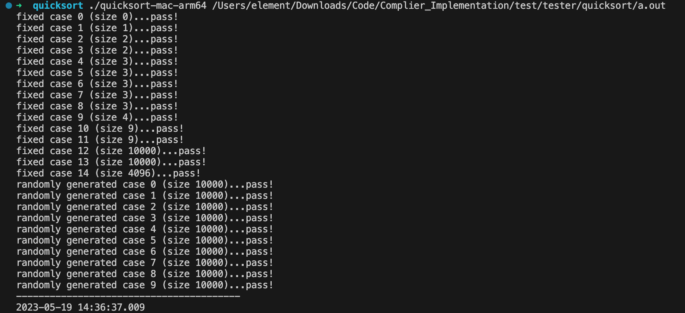

# 编译原理设计报告

## 1. 摘要

本报告描述了一个使用 SysY 语言实现的编译器，该编译器可以将 SysY 语言的源代码转换为目标代码。该项目涉及词法分析、语法分析、生成 LLVM IR，最终利用 LLVM 执行生成的 IR 生成目标代码。作为验证，我们编写了快速排序和矩阵乘法的 SysY 代码，并通过了相应的测试。

## 2. 系统设计

### 2.1 SysY语言

SysY 语言是一种简易的、类似 C 的编程语言，设计用于教学和研究目的。由于它的简洁性，SysY 语言可以帮助我们更容易地理解基本的编程概念，以下是 SysY 语言的一些主要特点：

1. 基本数据类型：SysY 语言支持整型（int）作为唯一的基本数据类型。整型可以用于表示整数、布尔值等。
2. 变量与赋值：SysY 语言允许声明全局和局部变量，支持基本的变量赋值操作。变量在声明时可以初始化。
3. 控制结构：SysY 语言提供了基本的控制结构，如条件语句（if-else）、循环语句（while、for）等。这使得程序员能够无缝地处理不同的程序分支和循环迭代。
4. 函数：SysY 支持函数的定义和调用。函数可以定义返回值类型（仅支持整型），并可以接收一系列参数。SysY 支持递归函数调用。
5. 数组：SysY 语言支持一维和多维数组。数组的元素类型是整型。可以在声明时指定数组长度和初始化数组元素。
6. 表达式：SysY 提供了丰富的表达式支持，包括算术、逻辑、关系和位操作符。与 C 语言类似，SysY 允许使用括号来指定运算顺序。
7. 注释：SysY 语言支持 C 风格的单行（使用 `//`）和多行（使用 `/*` 和 `*/`）注释。

SysY 语言的文法采用扩展的 Backus 范式 (EBNF, Extended Backus-Naur Form) 表示, 其中:

- 符号 `[...]` 表示方括号内包含的项可被重复 0 次或 1 次.
- 符号 `{...}` 表示花括号内包含的项可被重复 0 次或多次.
- 终结符是由双引号括起的串, 或者是 `IDENT`, `INT_CONST` 这样的大写记号. 其余均为非终结符.

SysY 语言的文法表示如下, `CompUnit` 为开始符号:

```c
CompUnit      ::= [CompUnit] (Decl | FuncDef);

Decl          ::= ConstDecl | VarDecl;
ConstDecl     ::= "const" BType ConstDef {"," ConstDef} ";";
BType         ::= "int";
ConstDef      ::= IDENT {"[" ConstExp "]"} "=" ConstInitVal;
ConstInitVal  ::= ConstExp | "{" [ConstInitVal {"," ConstInitVal}] "}";
VarDecl       ::= BType VarDef {"," VarDef} ";";
VarDef        ::= IDENT {"[" ConstExp "]"}
                | IDENT {"[" ConstExp "]"} "=" InitVal;
InitVal       ::= Exp | "{" [InitVal {"," InitVal}] "}";

FuncDef       ::= FuncType IDENT "(" [FuncFParams] ")" Block;
FuncType      ::= "void" | "int";
FuncFParams   ::= FuncFParam {"," FuncFParam};
FuncFParam    ::= BType IDENT ["[" "]" {"[" ConstExp "]"}];

Block         ::= "{" {BlockItem} "}";
BlockItem     ::= Decl | Stmt;
Stmt          ::= LVal "=" Exp ";"
                | [Exp] ";"
                | Block
                | "if" "(" Exp ")" Stmt ["else" Stmt]
                | "while" "(" Exp ")" Stmt
                | "break" ";"
                | "continue" ";"
                | "return" [Exp] ";";

Exp           ::= LOrExp;
LVal          ::= IDENT {"[" Exp "]"};
PrimaryExp    ::= "(" Exp ")" | LVal | Number;
Number        ::= INT_CONST;
UnaryExp      ::= PrimaryExp | IDENT "(" [FuncRParams] ")" | UnaryOp UnaryExp;
UnaryOp       ::= "+" | "-" | "!";
FuncRParams   ::= Exp {"," Exp};
MulExp        ::= UnaryExp | MulExp ("*" | "/" | "%") UnaryExp;
AddExp        ::= MulExp | AddExp ("+" | "-") MulExp;
RelExp        ::= AddExp | RelExp ("<" | ">" | "<=" | ">=") AddExp;
EqExp         ::= RelExp | EqExp ("==" | "!=") RelExp;
LAndExp       ::= EqExp | LAndExp "&&" EqExp;
LOrExp        ::= LAndExp | LOrExp "||" LAndExp;
ConstExp      ::= Exp;
```

### 2.2 词法分析器

#### 2.2.1 词法分析器模块概述

词法分析器 (Lexer) 是编译器中的一个关键模块，它的主要任务是将由源代码组成的字符序列转换为有意义的符号流（Token）。词法分析器负责识别源代码中的单词符号，包括关键字、变量名、数据类型、操作符等。

词法分析器作为编译过程的第一个阶段，是编译器框架的基础部分。在整个编译系统中，词法分析器通常与语法分析器（Parser）协同工作，共同完成源代码的解析过程。

#### 2.2.2 模块设计目的

词法分析器的设计目的是将源代码中的字符串分解为有意义的词汇单元（Token），并消除源代码中的空格、换行符等不必要字符，为后续的语法分析阶段提供简化版的输入。

#### 2.2.3 设计方案与思想

在本项目中，我们选择使用 Flex（一个词法分析器生成工具）来实现词法分析器。基于 Flex 来构建词法分析器，有以下几点优势:

- 可以轻松定义识别模式和相应的动作。
- Flex 会自动处理缓冲区管理、输入输出等底层细节。
- 与 Bison（一个用于生成语法分析器的工具）配合使用时，可以比较轻松地实现后续的编译器。

词法分析器负责将 SysY 语言的源代码转换为 token 序列。我们编写了一个词法分析器，它可以识别 SysY 语言的关键字、标识符、操作符、字面量等，同时每个正则表达式都会与一个相应的动作关联起来。

我们在 Flex 规约文件 `lexer.l` 中定义了 SysY 语言的词汇规则，以及识别到相应词汇时执行的代码动作，代码如下。

*lexer.l 规约代码*

```c
%option noyywrap
%option nounput
%option noinput

%{

#include <cstdlib>
#include <string>

// 因为 Flex 会用到 Bison 中关于 token 的定义
// 所以需要 include Bison 生成的头文件
#include "../build/parser.tab.hpp"

using namespace std;

%}

/* 空白符和注释 */
WhiteSpace    [ \t\n\r]*
LineComment   "//".*

/* 标识符 */
Identifier    [a-zA-Z_][a-zA-Z0-9_]*

/* 整数字面量 */
Decimal       [1-9][0-9]*
Octal         0[0-7]*
Hexadecimal   0[xX][0-9a-fA-F]+

String        \"[^\"]*\"


%%

{WhiteSpace}    { /* 忽略, 不做任何操作 */ }
{LineComment}   { /* 忽略, 不做任何操作 */ }

"int"           { return INT; }
"return"        { return RETURN; }
"void"          { return VOID; }
"const"         { return CONST;}
"while"         { return WHILE; }
"if"            { return IF; }
"else"          { return ELSE; }
"break"         { return BREAK; }
"continue"      { return CONTINUE; }
">="            { return GE; }
"<="            { return LE; }
">"             { return GT; }
"<"             { return LT; }
"=="            { return EQ; }
"!="            { return NE; }
"&&"            { return AND; }
"||"            { return OR; }

{Identifier}    { yylval.str_val = new string(yytext); return IDENT; }

{Decimal}       { yylval.int_val = strtol(yytext, nullptr, 0); return INT_CONST; }
{Octal}         { yylval.int_val = strtol(yytext, nullptr, 0); return INT_CONST; }
{Hexadecimal}   { yylval.int_val = strtol(yytext, nullptr, 0); return INT_CONST; }

{String}        { yylval.str_val = new string(yytext); return STR; }

.               { return yytext[0]; }

%%

```

#### 2.2.4 模块特性

通过使用 Flex 来生成词法分析器，我们实现了以下特性：

- 准确识别 SysY 语言的关键字、变量名、操作符、数据类型等词汇单元。
- 自动消除源代码中的空白字符、换行符等不必要字符。
- 用户友好的错误报告，当源代码存在无法识别的符号时，提供清晰的出错信息。
- 与 Bison 生成的语法分析器紧密集成，为后续的语法分析阶段提供舒适的接口。

#### 2.2.5 使用本模块的方法

词法分析器模块使用 Flex 工具生成。首先需要创建一个名为 `lexer.l` 的 Flex 规约文件，其中包含 SysY 语言的词汇规则定义以及识别相应词汇时执行的代码动作。然后使用 `flex` 命令来生成词法分析器的源代码 (lexer.c)：

```
flex lexer.l
```

词法分析器的源代码文件（lexer.c）可以与其他源代码文件一起编译，以生成完整的编译器。在编译器中，可以通过调用词法分析器的相关函数（例如 `yylex()`）来开始词法分析过程，并将生成的 Token 传递给后续的语法分析阶段。

### 2.3 语法分析器

语法分析器将由词法分析器生成的 token 序列转换为抽象语法树（AST）。我们使用了递归下降方法实现 SysY 语言的语法分析器。

#### 2.3.1 语法分析器模块概述

语法分析器 (Parser) 是编译器的关键模块之一。它的主要任务是根据词法分析器生成的 Token 序列来分析程序的语法结构并构建抽象语法树 (Abstract Syntax Tree, AST)。AST 以树形结构表示程序代码，能够准确地展现代码的层次与逻辑关系。

语法分析器在整个编译过程中紧跟在词法分析器之后，负责解析源代码的结构。此外，语法分析器还需要处理语法中的歧义和优先级问题，确保程序的逻辑正确。

#### 2.3.2 模块设计目的

设计语法分析器的主要目的是捕捉源代码中的逻辑关系和控制结构。通过构建抽象语法树，将源代码转换为更容易处理的结构化模型，将方便后续的代码生成阶段。

#### 2.3.3 设计方案与思想

在本项目中，我们选择使用 Bison（一个生成语法分析器的工具）来构建 SysY 语言的语法分析器，并结合一组自定义的AST节点类来构建抽象语法树。Bison 可以有效地将上下文无关文法表示为可执行程序，与 Flex 词法分析器生成工具配合使用，可以方便地实现完整的编译器。

为了表示抽象语法树，我们定义了一组AST节点类，它们都继承自基类`BaseAST`。这些节点类表示了程序代码中不同的结构和语义元素，如声明、函数定义、表达式等。在Bison动作中，我们将创建这些节点类的对象，并根据语法规则将它们组织为一棵树形结构。开始节点及CompUnit定义如下：

```c++
enum ASTtype {
  base,
  comp_unit,
  //..
};
class BaseAST {
 public:
  ASTtype type;
  int id;
  virtual void printTree() = 0;
  virtual std::vector<BaseIr *> buildIrNodes(){};
  virtual BaseIr *buildIrTree(){};
  virtual ~BaseAST() = default;
};

class StartRoot : public BaseAST {
 public:
  std::unique_ptr<BaseAST> comp_unit_ast;
  virtual void printTree() override;
  virtual BaseIr *buildIrTree();
  virtual ~StartRoot() override{};
};

class CompUnitAST : public BaseAST {
 public:
  std::unique_ptr<BaseAST> func_def_ast;
  std::unique_ptr<BaseAST> decl_ast;
  std::unique_ptr<BaseAST> comp_unit_ast;
  virtual void printTree() override;
  virtual ~CompUnitAST() override{};
};
```

其余节点定义也类似。

接着，我们使用 Bison 构建语法分析器，首先创建一个名为 `parser.y` 的文件，其中包含 SysY 语言语法规则的定义。同时，在定义语法规则时，我们为每个规则都关联一个动作。在动作中，我们根据当前处理的规则来实例化相应的AST节点，并通过设置其子节点及属性来构建出完整的抽象语法树。开始节点及CompUnit定义如下：

```c++
StartRoot
  : CompUnit {
    auto start_root = make_unique<StartRoot>();;
    start_root->comp_unit_ast = std::unique_ptr<BaseAST>($1);
    start_root->id = id++;
    ast = move(start_root);
    //std::cout<<"CompUnit"<<endl;
  }
  ;

CompUnit
  : CompUnit FuncDef {
    auto ast = new CompUnitAST();
    ast->comp_unit_ast = unique_ptr<BaseAST>($1);
    ast->decl_ast = nullptr;
    ast->func_def_ast = unique_ptr<BaseAST>($2);
    ast->id = id++;
    $$ = ast;
    //std::cout<<"CompUnit FuncDef"<<endl;
  }
  | {
      $$ = nullptr;
  }
  ;
```

这段代码是根据 SysY 语言的语法规则来定义的，它的主要作用是接收词法分析器提供的 Token 序列并根据这些 Tokens 构建抽象语法树。

首先，我们定义了两个规则：`StartRoot` 和 `CompUnit`。

- `StartRoot` 规则：在这个规则中，我们期望从 `CompUnit` 规则得到一个 `BaseAST` 对象。接着，我们创建一个 `StartRoot` 对象，并将其子树设置为从 `CompUnit` 规则得到的树。最后，为了确保树的结构的唯一性，我们为每个 `StartRoot` 节点分配一个唯一的 ID。

```c++
StartRoot
  : CompUnit {
    auto start_root = make_unique<StartRoot>();;
    start_root->comp_unit_ast = std::unique_ptr<BaseAST>($1);
    start_root->id = id++;
    ast = move(start_root);
    //std::cout<<"CompUnit"<<endl;
  }
  ;
```

- `CompUnit` 规则：这个规则定义了如何构建一个包含声明（`Decl`）和函数定义（`FuncDef`）的复合单元。这个规则包含两个候选项，它们分别处理声明或函数定义的递归组合，或者是一个空节点：

  - 第一个候选项表示一个 `CompUnit` 后面跟着一个 `FuncDef`。这里，我们创建一个 `CompUnitAST` 对象，并将其子树设置为从 `CompUnit` 和 `FuncDef` 规则得到的树，同时将其 `decl_ast` 设为 `nullptr`。最后，为每个 `CompUnitAST` 节点分配一个唯一的 ID。
  
  ```c++
  | CompUnit FuncDef {
    auto ast = new CompUnitAST();
    ast->comp_unit_ast = unique_ptr<BaseAST>($1);
    ast->decl_ast = nullptr;
    ast->func_def_ast = unique_ptr<BaseAST>($2);
    ast->id = id++;
    $$ = ast;
    //std::cout<<"CompUnit FuncDef"<<endl;
  }
  ```
  
  - 第二个候选项表示匹配空字符串的情况。在这种情况下，我们将返回值设为 `nullptr`。
  
  ```c++
  | {
      $$ = nullptr;
  }
  ;
  ```

其他规则也类似这样进行定义，在根据SysY语言的语法规则完成编写后，我们就可以将输入代码有效地解析为树形结构的抽象语法树，从而为后续的编译过程提供有价值的信息。在语法分析器模块设计过程中，我们权衡了灵活性、易用性以及性能等因素，通过使用Bison工具及自定义AST节点类来实现一个高效、可维护的语法分析器。

#### 2.3.4 模块特性

通过使用 Bison 生成语法分析器，我们实现了以下特性：

- 准确解析 SysY 语言的语法结构，如声明、表达式、控制结构等。
- 自动生成高效且可维护的解析器工具。
- 编写简洁易懂的语法规则描述文件。
- 与 Flex 生成的词法分析器紧密集成。
- 构建抽象语法树 (AST) 以方便后续阶段处理。

#### 2.3.5 使用本模块的方法

要使用本模块，需要首先编写 `parser.y` 文件，定义语法规则以及解析这些规则形成 AST 时执行的相关动作。然后，利用 Bison 工具编译生成语法分析器源代码。源代码文件中包括一个名为 "yyparse()" 的函数。在主函数中，需要先调用词法分析器，然后调用 "yyparse()" 函数开始语法分析过程，最终生成抽象语法树。

### 2.4 生成 LLVM IR

#### 2.4.1 生成 LLVM IR 模块概述

生成 LLVM IR（中间表示）模块的主要目的是将由语法分析器生成的抽象语法树（AST）转换为 LLVM IR，这样我们可以利用 LLVM 的优化、代码生成等工具来为不同的平台生成可执行文件。

LLVM IR 是一种中间表示形式，它是一种能够方便地表示高级编程语言结构的低级别模型。通过生成 LLVM IR，我们可以将 SysY 语言的编译与 LLVM 的底层实现、优化和目标平台生成代码解耦。

#### 2.4.2 模块设计目的

模块的主要目的是将抽象语法树转换为对应的 LLVM IR 代码，进一步优化和生成目标平台的可执行文件。通过生成 LLVM IR，我们可以利用 LLVM 提供的各种工具和功能，优化生成的代码，确保生成的目标代码具有较好的性能。

#### 2.4.3 设计方案与思想

在本项目中，我们为每一个 AST 节点类实现了一个将该节点转换为 LLVM IR 代码的方法。这些方法递归地遍历整个 AST，并根据每个节点的类型和属性生成对应的 LLVM IR 代码。

我们通过编写代码来生成 LLVM IR 的相应指令，如赋值、运算、控制流等。我们还确保生成的代码遵循 LLVM IR 的规范，如 SSA（Static Single Assignment）形式等。

为了实现这一设计，我们首先学习了 LLVM IR 的语法和规范。接着，我们阅读了 LLVM 的文档和源代码，了解了如何使用 LLVM 提供的 API 来动态地生成相应的 IR 代码。在实现过程中，我们始终关注生成的 IR 代码的正确性和优化潜力。

#### 2.4.4 模块特性

通过实现生成 LLVM IR 模块，我们实现了如下特性：

- 递归地将抽象语法树转换为相应的 LLVM IR 代码
- 生成符合 LLVM IR 规范的代码
- 充分利用 LLVM 提供的 API 来简化代码生成过程
- 在生成的 IR 代码中保留了源代码的结构和语义信息
- 为后续的 LLVM 优化和目标代码生成提供了良好的基础

#### 2.4.5 使用本模块的方法？？

要使用本模块，需要首先确保已经成功生成了抽象语法树（AST）。之后，对每个 AST 节点调用实现的生成 LLVM IR 的方法。该方法会递归地产生整个 AST 对应的 LLVM IR 代码。

在生成完成后，可以将得到的 LLVM IR 代码传递给 LLVM 提供的优化和目标代码生成工具，为不同平台生成可执行文件。同时，可以将 IR 代码输出到文件或控制台，以便于分析和调试。通过本模块的设计，SysY 语言编译器可以方便地生成对应的 LLVM IR 代码，进一步推动编译过程。

在本项目的实现示例中，我们将生成的IR按照对应输出规则打印到控制台输出，使用 `ast->printTree()` 方法展示生成的 IR树结构用于验证所生成的中间代码正确性。

其中打印输出的内容可以放置到 https://graphviz.christine.website/ 中进行IR树的查看。

比如对以下的简单代码

```c++
int main()
{
    int a;
    a = 0;
    return 0;
}
```

通过语法分析器生成AST后可以输出IR树及中间代码

```

```


```c
define i32 @main() #0 {
  %1 = alloca i32, align 4
  store i32 0, i32* %1, align 4
  ret i32 0
}

declare i32 @scanf(i8 * noundef, ...) #1
declare i32 @printf(i8 * noundef, ...) #1
```

通过Graphviz网站可以显示对应的可视化树形结构如下：


### 

### 2.5 生成目标代码

在生成了 LLVM IR 后，接下来的重要步骤是将其转换为最终的可执行目标代码。我们将利用 LLVM 提供的功能来实现这一过程。

#### 2.5.1 生成目标代码模块概述

生成目标代码模块的主要目的是将编译器生成的 LLVM IR 转换为特定平台的可执行文件。生成的可执行文件可以在目标系统上运行，以便开发者和用户执行程序。通过使用 LLVM 提供的工具链，我们可以轻松地将 IR 转换为各种平台的目标代码，同时对生成的代码进行优化。

#### 2.5.2 模块设计目的

本模块旨在提供一个可靠的方式来处理编译器生成的 LLVM IR，并生成对应平台的目标代码。通过与 LLVM 相集成，我们可以在生成高效可执行文件时充分利用 LLVM 提供的代码优化和生成能力。

#### 2.5.3 设计方案与思想

本项目利用 LLVM 提供的 `llc` 命令行工具来将生成的 LLVM IR 转换为目标代码。`llc` 具有处理 LLVM IR 文件的功能，并根据指定的参数生成特定平台的目标代码文件。我们可以通过如下命令来生成目标代码：

```
llc -filetype=obj main.ll -o main.o
```

这个命令告诉 `llc` 从名为 `main.ll` 的文件中读取 LLVM IR，并以 `obj` 格式输出目标代码文件 `main.o`。在完成代码生成后，可以链接目标代码生成最终的可执行文件。

#### 2.5.4 模块特性

通过集成 LLVM 的 `llc` 工具，支持以下特性：

- 将 LLVM IR 文件转换为特定平台的目标代码
- 利用 LLVM 提供的代码生成和优化功能
- 高效的目标代码生成过程
- 支持多种平台和处理器架构
- 简化编译器后端的实现

#### 2.5.5 使用本模块的方法

使用本模块需要首先生成包含 LLVM IR 的 .ll 文件。然后，可以通过运行上面提供的 `llc` 命令将 .ll 文件转换为目标代码。最后，还需要将目标代码链接为可执行文件。

使用这种方法，我们可以在不同平台上生成高效的目标代码，从而实现 SysY 语言编译器的目标。

## 3. 测试与验证

为了验证我们的编译器是否正确实现了 SysY 语言的功能，我们编写了快速排序和矩阵乘法的代码，并通过了相应的测试。

### 3.1 快速排序

我们编写了一个 SysY 语言程序，实现了基本的快速排序算法，代码如下：

```c
int main(){
  int a[10];
  int len;
  int i;
  i=0;
  scanf("%d",&len);
  while(i<len){
    scanf("%d",&a[i]);
    i=i+1;
  }
  quick_sort(a,len);

  i=0;
  while(i<len){
    printf("%d ",a[i]);
    i=i+1;
  }
  
  printf("\n");
  return 0;
}


void quick_sort(int arr[], int len) {
    quick_sort_recursive(arr, 0, len - 1);
}

void quick_sort_recursive(int arr[], int start, int end) {
    if (start >= end){
        
    }else{
        int mid;
        mid = arr[end];
        int left;
        left = start;
        int right;
        right = end - 1;
        while (left < right) {
            while (arr[left] < mid && left < right){
                left = left+1;
            }

            while (arr[right] >= mid && left < right){
                 right = right-1;
            }

            swap(arr+left, arr+right);
        }
        if (arr[left] >= arr[end]){
          swap(arr+left, arr+end);
        }
        else{
          left = left + 1;
        }
        if (left) {
            quick_sort_recursive(arr, start, left - 1);
        }else{}
        quick_sort_recursive(arr, left + 1, end);
    }
    
}


void swap(int x[], int y[]) {
    int t;
    t = x[0];
    x[0] = y[0];
    y[0] = t;
}
```

对应生成的中间代码在附录中展示，通过所提供的快速排序测试程序，通过结果如下图：



### 3.2 矩阵乘法

我们编写了一个 SysY 语言程序，实现了矩阵乘法算法，代码如下：

```c
int main()
{
    int M1;
    int N1;
    int M2;
    int N2;
    int A[625];
    int B[625];
    int C[625];
    int i;
    int j;
    int k;
    int temp;
    int sum;
    int count;
    int loop;
    int tmp1;
    int tmp2;
    // 输入矩阵 A
    scanf("%d %d", &M1, &N1);
    i = 0;
    loop = 0;
    while (loop < M1)
    {
        j = 0;
        while (j < N1)
        {
            scanf("%d", &A[i]);
            i = i + 1;
            j = j + 1;
        }
        loop = loop + 1;
    }

    // 输入矩阵 B
    scanf("%d %d", &M2, &N2);
    i = 0;
    loop = 0;
    while (loop < M2)
    {
        j = 0;
        while (j < N2)
        {
            scanf("%d", &B[i]);
            i = i + 1;
            j = j + 1;
        }
        loop = loop + 1;
    }
    if (N1 != M2)
    {
        printf("Incompatible Dimensions\n");
    }
    else
    {
        // 计算矩阵乘法
        i = 0;
        loop = 0;
        while (loop < M1)
        {
            j = 0;
            while (j < N2)
            {
                sum = 0;
                k = 0;
                while (k < N1)
                {
                    // 实现乘法
                    temp = 0;
                    count = 0;

                    tmp1 = multiple(loop, N1);
                    tmp2 = multiple(k, N2);
                    //printf("a=%d b=%d\n",A[tmp1 + k], B[tmp2 + j]);
                    temp = multiple(A[tmp1 + k], B[tmp2 + j]);
                    //printf("temp=%d\n",temp);
                    sum = sum + temp;
                    k = k + 1;
                }

                tmp1 = multiple(loop, N2);
                C[tmp1 + j] = sum;
                j = j + 1;
            }
            loop = loop + 1;
        }
        // 输出结果
        i = 0;
        loop = 0;
        while (loop < M1)
        {
            j = 0;
            while (j < N2)
            {
                tmp1 = multiple(loop, N2);
                printf("%10d", C[tmp1 + j]);
                j = j + 1;
            }
            printf("\n");
            loop = loop + 1;
        }
    }

    return 0;
}
int multiple(int a, int b)
{
    int sign;
    int retVal;
    retVal = 0;
    if (a > 0)
    {
        if (b > 0)
        {
            sign = 1;
        }else{}
        if (b == 0)
        {
            sign = 0;
            retVal = 0;
        }else{}
        if (b < 0)
        {
            sign = 0;
            sign=sign-1;
        }else{}
    }else{}
    if (a == 0)
    {
        sign = 0;
        retVal = 0;
    }
    else{}
    if (a < 0)
    {
        if (b > 0)
        {
            sign = 0;
            sign=sign-1;
            //printf("a=%d,b=%d,sign=%d",a,b,sign);
        }else{}
        if (b == 0)
        {
            sign = 0;
            retVal = 0;
        }else{}
        if (b < 0)
        {
            sign = 1;
        }else{}
    }else{}
    if (a < 0)
    {
        a = 0 - a;
    }else{}
    if (b < 0)
    {
        b = 0 - b;
    }else{}

    if (sign == 1)
    {
        int i;
        i = 0;
        while (i < b)
        {
            retVal = retVal + a;
            i = i + 1;
        }
    }
    else{}
    int ne;
    ne=0;
    ne=ne-1;
    if(sign==ne)
    {
        int j;
        j = 0;
        while (j < b)
        {
            retVal = retVal - a;
            j = j + 1;
        }
    }else{}
    return retVal;
}
```

对应生成的中间代码在附录中展示，通过所提供的矩阵乘法测试程序，通过结果如下图：


## 4. 结论

在本项目中，我们设计并实现了一个完整的 SysY 语言编译器。编译器从源代码到生成 LLVM IR 的过程分为多个阶段，包括词法分析、语法分析、生成 LLVM IR 以及目标代码生成。我们利用工具如 Flex 和 Bison 以及 LLVM API 来简化词法分析、语法分析和生成 LLVM IR 的过程。同时确保生成的 LLVM IR 文件遵循 LLVM IR 规范，并能有效地转换为各种平台的目标代码。

1. 在词法分析阶段，我们使用 Flex 词法分析器生成工具根据命名规则及相关动作来实现词法分析器。优势在于易于定义识别模式，自动处理缓冲区管理等底层细节，以及与 Bison 生成的语法分析器的紧密集成。
2. 在语法分析阶段，我们利用 Bison 工具及自定义的 AST 节点类实现了一个高效、可维护的语法分析器。通过观察 SysY 语言的语法规则及相应动作，我们将输入代码有效地解析为树形结构的抽象语法树以便后续处理。
3. 在生成 LLVM IR 阶段，我们为每个 AST 节点类添加了将该节点转换为对应 LLVM IR 代码的方法。充分利用 LLVM 提供的 API 来简化代码生成过程，同时为后续优化及目标代码生成提供基础。
4. 在生成目标代码阶段，我们使用 LLVM 提供的 `llc` 工具将生成的 LLVM IR 转换为目标代码。在生成高效可执行文件时充分利用 LLVM 提供的代码优化和生成能力。

我们所设计的 SysY 语言编译器具有良好的可维护性、易用性和扩展性，可以轻松地将 SysY 语言源代码转换为 LLVM IR 及特定平台的目标代码。

## 附录

### 快速排序中间代码

```assembly
@.str = private unnamed_addr constant [3 x i8] c"%d\00", align 1
@.str.1 = private unnamed_addr constant [4 x i8] c"%d \00", align 1
@.str.2 = private unnamed_addr constant [2 x i8] c"\0A\00", align 1
define i32 @main() #0 {
  %1 = alloca [10 x i32], align 16
  %2 = alloca i32, align 4
  %3 = alloca i32, align 4
  store i32 0, i32* %3, align 4
  %4 = call i32 (i8*, ...) @scanf(i8* noundef getelementptr inbounds ([3 x i8], [3 x i8]* @.str,i64 0, i64 0), i32* noundef %2)
  br label %5
5:
  %6 = load i32, i32* %3, align 4
  %7 = load i32, i32* %2, align 4
  %8 = icmp slt i32 %6, %7
  %9 = zext i1 %8 to i32
  %10 = icmp ne i32 %9, 0
  br i1 %10, label %11, label %18

11:
  %12 = load i32, i32* %3, align 4
  %13 = sext i32 %12 to i64
  %14 = getelementptr inbounds [10 x i32], [10 x i32]* %1, i64 0, i64 %13
  %15 = call i32 (i8*, ...) @scanf(i8* noundef getelementptr inbounds ([3 x i8], [3 x i8]* @.str,i64 0, i64 0), i32* noundef %14)
  %16 = load i32, i32* %3, align 4
  %17 = add nsw i32 1, %16
  store i32 %17, i32* %3, align 4
  br label %5
18:
  %19 = getelementptr inbounds [10 x i32], [10 x i32]* %1, i64 0, i64 0
  %20 = load i32, i32* %2, align 4
  call void @quick_sort(i32* %19, i32 %20)
  store i32 0, i32* %3, align 4
  br label %21
21:
  %22 = load i32, i32* %3, align 4
  %23 = load i32, i32* %2, align 4
  %24 = icmp slt i32 %22, %23
  %25 = zext i1 %24 to i32
  %26 = icmp ne i32 %25, 0
  br i1 %26, label %27, label %35

27:
  %28 = load i32, i32* %3, align 4
  %29 = sext i32 %28 to i64
  %30 = getelementptr inbounds [10 x i32], [10 x i32]* %1, i64 0, i64 %29
  %31 = load i32, i32* %30, align 4
  %32 = call i32 (i8*, ...) @printf(i8* noundef getelementptr inbounds ([4 x i8], [4 x i8]* @.str.1,i64 0, i64 0), i32 %31)
  %33 = load i32, i32* %3, align 4
  %34 = add nsw i32 1, %33
  store i32 %34, i32* %3, align 4
  br label %21
35:
  %36 = call i32 (i8*, ...) @printf(i8* noundef getelementptr inbounds ([3 x i8], [3 x i8]* @.str.2,i64 0, i64 0))
  ret i32 0
}

define void @quick_sort(i32* noundef %0, i32 noundef %1) #0 {
  %3 = alloca i32*, align 8
  store i32* %0, i32** %3, align 8
  %4 = alloca i32, align 4
  store i32 %1, i32* %4, align 4
  %5 = load i32*, i32** %3, align 8
  %6 = load i32, i32* %4, align 4
  %7 = sub nsw i32 %6, 1
  call void @quick_sort_recursive(i32* %5, i32 0, i32 %7)
  ret void
}

define void @quick_sort_recursive(i32* noundef %0, i32 noundef %1, i32 noundef %2) #0 {
  %4 = alloca i32*, align 8
  store i32* %0, i32** %4, align 8
  %5 = alloca i32, align 4
  store i32 %1, i32* %5, align 4
  %6 = alloca i32, align 4
  store i32 %2, i32* %6, align 4
  %7 = load i32, i32* %5, align 4
  %8 = load i32, i32* %6, align 4
  %9 = icmp sge i32 %7, %8
  %10 = zext i1 %9 to i32
  %11 = icmp ne i32 %10, 0
  br i1 %11, label %12, label %13

12:
  br label %128
13:
  %14 = alloca i32, align 4
  %15 = load i32*, i32** %4, align 8
  %16 = load i32, i32* %6, align 4
  %17 = sext i32 %16 to i64
  %18 = getelementptr inbounds i32, i32*%15, i64 %17
  %19 = load i32, i32* %18, align 4
  store i32 %19, i32* %14, align 4
  %20 = alloca i32, align 4
  %21 = load i32, i32* %5, align 4
  store i32 %21, i32* %20, align 4
  %22 = alloca i32, align 4
  %23 = load i32, i32* %6, align 4
  %24 = sub nsw i32 %23, 1
  store i32 %24, i32* %22, align 4
  br label %25
25:
  %26 = load i32, i32* %20, align 4
  %27 = load i32, i32* %22, align 4
  %28 = icmp slt i32 %26, %27
  %29 = zext i1 %28 to i32
  %30 = icmp ne i32 %29, 0
  br i1 %30, label %31, label %88

31:
  br label %32
32:
  %33 = load i32*, i32** %4, align 8
  %34 = load i32, i32* %20, align 4
  %35 = sext i32 %34 to i64
  %36 = getelementptr inbounds i32, i32*%33, i64 %35
  %37 = load i32, i32* %36, align 4
  %38 = load i32, i32* %14, align 4
  %39 = icmp slt i32 %37, %38
  %40 = zext i1 %39 to i32
  %41 = icmp ne i32 %40, 0
  br i1 %41, label %42, label %48
42:
  %43 = load i32, i32* %20, align 4
  %44 = load i32, i32* %22, align 4
  %45 = icmp slt i32 %43, %44
  %46 = zext i1 %45 to i32
  %47 = icmp ne i32 %46, 0
  br label %48
48:
  %49 = phi i1 [ false, %32 ], [ %47, %42 ]
  %50 = zext i1 %49 to i32
  %51 = icmp ne i32 %50, 0
  br i1 %51, label %52, label %55

52:
  %53 = load i32, i32* %20, align 4
  %54 = add nsw i32 1, %53
  store i32 %54, i32* %20, align 4
  br label %32
55:
  br label %56
56:
  %57 = load i32*, i32** %4, align 8
  %58 = load i32, i32* %22, align 4
  %59 = sext i32 %58 to i64
  %60 = getelementptr inbounds i32, i32*%57, i64 %59
  %61 = load i32, i32* %60, align 4
  %62 = load i32, i32* %14, align 4
  %63 = icmp sge i32 %61, %62
  %64 = zext i1 %63 to i32
  %65 = icmp ne i32 %64, 0
  br i1 %65, label %66, label %72
66:
  %67 = load i32, i32* %20, align 4
  %68 = load i32, i32* %22, align 4
  %69 = icmp slt i32 %67, %68
  %70 = zext i1 %69 to i32
  %71 = icmp ne i32 %70, 0
  br label %72
72:
  %73 = phi i1 [ false, %56 ], [ %71, %66 ]
  %74 = zext i1 %73 to i32
  %75 = icmp ne i32 %74, 0
  br i1 %75, label %76, label %79

76:
  %77 = load i32, i32* %22, align 4
  %78 = sub nsw i32 %77, 1
  store i32 %78, i32* %22, align 4
  br label %56
79:
  %80 = load i32*, i32** %4, align 8
  %81 = load i32, i32* %20, align 4
  %82 = sext i32 %81 to i64
  %83 = getelementptr inbounds i32, ptr %80, i64 %82
  %84 = load i32*, i32** %4, align 8
  %85 = load i32, i32* %22, align 4
  %86 = sext i32 %85 to i64
  %87 = getelementptr inbounds i32, ptr %84, i64 %86
  call void @swap(i32* %83, i32* %87)
  br label %25
88:
  %89 = load i32*, i32** %4, align 8
  %90 = load i32, i32* %20, align 4
  %91 = sext i32 %90 to i64
  %92 = getelementptr inbounds i32, i32*%89, i64 %91
  %93 = load i32, i32* %92, align 4
  %94 = load i32*, i32** %4, align 8
  %95 = load i32, i32* %6, align 4
  %96 = sext i32 %95 to i64
  %97 = getelementptr inbounds i32, i32*%94, i64 %96
  %98 = load i32, i32* %97, align 4
  %99 = icmp sge i32 %93, %98
  %100 = zext i1 %99 to i32
  %101 = icmp ne i32 %100, 0
  br i1 %101, label %102, label %111

102:
  %103 = load i32*, i32** %4, align 8
  %104 = load i32, i32* %20, align 4
  %105 = sext i32 %104 to i64
  %106 = getelementptr inbounds i32, ptr %103, i64 %105
  %107 = load i32*, i32** %4, align 8
  %108 = load i32, i32* %6, align 4
  %109 = sext i32 %108 to i64
  %110 = getelementptr inbounds i32, ptr %107, i64 %109
  call void @swap(i32* %106, i32* %110)
  br label %114
111:
  %112 = load i32, i32* %20, align 4
  %113 = add nsw i32 1, %112
  store i32 %113, i32* %20, align 4
  br label %114
114:
  %115 = load i32, i32* %20, align 4
  %116 = icmp ne i32 %115, 0
  br i1 %116, label %117, label %122

117:
  %118 = load i32*, i32** %4, align 8
  %119 = load i32, i32* %5, align 4
  %120 = load i32, i32* %20, align 4
  %121 = sub nsw i32 %120, 1
  call void @quick_sort_recursive(i32* %118, i32 %119, i32 %121)
  br label %123
122:
  br label %123
123:
  %124 = load i32*, i32** %4, align 8
  %125 = load i32, i32* %20, align 4
  %126 = add nsw i32 1, %125
  %127 = load i32, i32* %6, align 4
  call void @quick_sort_recursive(i32* %124, i32 %126, i32 %127)
  br label %128
128:
  ret void
}

define void @swap(i32* noundef %0, i32* noundef %1) #0 {
  %3 = alloca i32*, align 8
  store i32* %0, i32** %3, align 8
  %4 = alloca i32*, align 8
  store i32* %1, i32** %4, align 8
  %5 = alloca i32, align 4
  %6 = load i32*, i32** %3, align 8
  %7 = getelementptr inbounds i32, i32*%6, i64 0
  %8 = load i32, i32* %7, align 4
  store i32 %8, i32* %5, align 4
  %9 = load i32*, i32** %4, align 8
  %10 = getelementptr inbounds i32, i32*%9, i64 0
  %11 = load i32, i32* %10, align 4
  %12 = load i32*, i32** %3, align 8
  %13 = getelementptr inbounds i32, i32*%12, i64 0
  store i32 %11, i32* %13, align 4
  %14 = load i32, i32* %5, align 4
  %15 = load i32*, i32** %4, align 8
  %16 = getelementptr inbounds i32, i32*%15, i64 0
  store i32 %14, i32* %16, align 4
  ret void
}

declare i32 @scanf(i8 * noundef, ...) #1
declare i32 @printf(i8 * noundef, ...) #1

```

### 矩阵乘法中间代码

```assembly
@.str = private unnamed_addr constant [6 x i8] c"%d %d\00", align 1
@.str.1 = private unnamed_addr constant [3 x i8] c"%d\00", align 1
@.str.2 = private unnamed_addr constant [25 x i8] c"Incompatible Dimensions\0A\00", align 1
@.str.3 = private unnamed_addr constant [5 x i8] c"%10d\00", align 1
@.str.4 = private unnamed_addr constant [2 x i8] c"\0A\00", align 1
define i32 @main() #0 {
  %1 = alloca i32, align 4
  %2 = alloca i32, align 4
  %3 = alloca i32, align 4
  %4 = alloca i32, align 4
  %5 = alloca [625 x i32], align 16
  %6 = alloca [625 x i32], align 16
  %7 = alloca [625 x i32], align 16
  %8 = alloca i32, align 4
  %9 = alloca i32, align 4
  %10 = alloca i32, align 4
  %11 = alloca i32, align 4
  %12 = alloca i32, align 4
  %13 = alloca i32, align 4
  %14 = alloca i32, align 4
  %15 = alloca i32, align 4
  %16 = alloca i32, align 4
  %17 = call i32 (i8*, ...) @scanf(i8* noundef getelementptr inbounds ([6 x i8], [6 x i8]* @.str,i64 0, i64 0), i32* noundef %1, i32* noundef %2)
  store i32 0, i32* %8, align 4
  store i32 0, i32* %14, align 4
  br label %18
18:
  %19 = load i32, i32* %14, align 4
  %20 = load i32, i32* %1, align 4
  %21 = icmp slt i32 %19, %20
  %22 = zext i1 %21 to i32
  %23 = icmp ne i32 %22, 0
  br i1 %23, label %24, label %43

24:
  store i32 0, i32* %9, align 4
  br label %25
25:
  %26 = load i32, i32* %9, align 4
  %27 = load i32, i32* %2, align 4
  %28 = icmp slt i32 %26, %27
  %29 = zext i1 %28 to i32
  %30 = icmp ne i32 %29, 0
  br i1 %30, label %31, label %40

31:
  %32 = load i32, i32* %8, align 4
  %33 = sext i32 %32 to i64
  %34 = getelementptr inbounds [625 x i32], [625 x i32]* %5, i64 0, i64 %33
  %35 = call i32 (i8*, ...) @scanf(i8* noundef getelementptr inbounds ([3 x i8], [3 x i8]* @.str.1,i64 0, i64 0), i32* noundef %34)
  %36 = load i32, i32* %8, align 4
  %37 = add nsw i32 1, %36
  store i32 %37, i32* %8, align 4
  %38 = load i32, i32* %9, align 4
  %39 = add nsw i32 1, %38
  store i32 %39, i32* %9, align 4
  br label %25
40:
  %41 = load i32, i32* %14, align 4
  %42 = add nsw i32 1, %41
  store i32 %42, i32* %14, align 4
  br label %18
43:
  %44 = call i32 (i8*, ...) @scanf(i8* noundef getelementptr inbounds ([6 x i8], [6 x i8]* @.str,i64 0, i64 0), i32* noundef %3, i32* noundef %4)
  store i32 0, i32* %8, align 4
  store i32 0, i32* %14, align 4
  br label %45
45:
  %46 = load i32, i32* %14, align 4
  %47 = load i32, i32* %3, align 4
  %48 = icmp slt i32 %46, %47
  %49 = zext i1 %48 to i32
  %50 = icmp ne i32 %49, 0
  br i1 %50, label %51, label %70

51:
  store i32 0, i32* %9, align 4
  br label %52
52:
  %53 = load i32, i32* %9, align 4
  %54 = load i32, i32* %4, align 4
  %55 = icmp slt i32 %53, %54
  %56 = zext i1 %55 to i32
  %57 = icmp ne i32 %56, 0
  br i1 %57, label %58, label %67

58:
  %59 = load i32, i32* %8, align 4
  %60 = sext i32 %59 to i64
  %61 = getelementptr inbounds [625 x i32], [625 x i32]* %6, i64 0, i64 %60
  %62 = call i32 (i8*, ...) @scanf(i8* noundef getelementptr inbounds ([3 x i8], [3 x i8]* @.str.1,i64 0, i64 0), i32* noundef %61)
  %63 = load i32, i32* %8, align 4
  %64 = add nsw i32 1, %63
  store i32 %64, i32* %8, align 4
  %65 = load i32, i32* %9, align 4
  %66 = add nsw i32 1, %65
  store i32 %66, i32* %9, align 4
  br label %52
67:
  %68 = load i32, i32* %14, align 4
  %69 = add nsw i32 1, %68
  store i32 %69, i32* %14, align 4
  br label %45
70:
  %71 = load i32, i32* %2, align 4
  %72 = load i32, i32* %3, align 4
  %73 = icmp ne i32 %71, %72
  %74 = zext i1 %73 to i32
  %75 = icmp ne i32 %74, 0
  br i1 %75, label %76, label %78

76:
  %77 = call i32 (i8*, ...) @printf(i8* noundef getelementptr inbounds ([26 x i8], [26 x i8]* @.str.2,i64 0, i64 0))
  br label %171
78:
  store i32 0, i32* %8, align 4
  store i32 0, i32* %14, align 4
  br label %79
79:
  %80 = load i32, i32* %14, align 4
  %81 = load i32, i32* %1, align 4
  %82 = icmp slt i32 %80, %81
  %83 = zext i1 %82 to i32
  %84 = icmp ne i32 %83, 0
  br i1 %84, label %85, label %139

85:
  store i32 0, i32* %9, align 4
  br label %86
86:
  %87 = load i32, i32* %9, align 4
  %88 = load i32, i32* %4, align 4
  %89 = icmp slt i32 %87, %88
  %90 = zext i1 %89 to i32
  %91 = icmp ne i32 %90, 0
  br i1 %91, label %92, label %136

92:
  store i32 0, i32* %12, align 4
  store i32 0, i32* %10, align 4
  br label %93
93:
  %94 = load i32, i32* %10, align 4
  %95 = load i32, i32* %2, align 4
  %96 = icmp slt i32 %94, %95
  %97 = zext i1 %96 to i32
  %98 = icmp ne i32 %97, 0
  br i1 %98, label %99, label %124

99:
  store i32 0, i32* %11, align 4
  store i32 0, i32* %13, align 4
  %100 = load i32, i32* %14, align 4
  %101 = load i32, i32* %2, align 4
  %102 = call i32 @multiple(i32 %100, i32 %101)
  store i32 %102, i32* %15, align 4
  %103 = load i32, i32* %10, align 4
  %104 = load i32, i32* %4, align 4
  %105 = call i32 @multiple(i32 %103, i32 %104)
  store i32 %105, i32* %16, align 4
  %106 = load i32, i32* %15, align 4
  %107 = load i32, i32* %10, align 4
  %108 = add nsw i32 %106, %107
  %109 = sext i32 %108 to i64
  %110 = getelementptr inbounds [625 x i32], [625 x i32]* %5, i64 0, i64 %109
  %111 = load i32, i32* %110, align 4
  %112 = load i32, i32* %16, align 4
  %113 = load i32, i32* %9, align 4
  %114 = add nsw i32 %112, %113
  %115 = sext i32 %114 to i64
  %116 = getelementptr inbounds [625 x i32], [625 x i32]* %6, i64 0, i64 %115
  %117 = load i32, i32* %116, align 4
  %118 = call i32 @multiple(i32 %111, i32 %117)
  store i32 %118, i32* %11, align 4
  %119 = load i32, i32* %12, align 4
  %120 = load i32, i32* %11, align 4
  %121 = add nsw i32 %119, %120
  store i32 %121, i32* %12, align 4
  %122 = load i32, i32* %10, align 4
  %123 = add nsw i32 1, %122
  store i32 %123, i32* %10, align 4
  br label %93
124:
  %125 = load i32, i32* %14, align 4
  %126 = load i32, i32* %4, align 4
  %127 = call i32 @multiple(i32 %125, i32 %126)
  store i32 %127, i32* %15, align 4
  %128 = load i32, i32* %12, align 4
  %129 = load i32, i32* %15, align 4
  %130 = load i32, i32* %9, align 4
  %131 = add nsw i32 %129, %130
  %132 = sext i32 %131 to i64
  %133 = getelementptr inbounds [625 x i32], [625 x i32]* %7, i64 0, i64 %132
  store i32 %128, i32* %133, align 4
  %134 = load i32, i32* %9, align 4
  %135 = add nsw i32 1, %134
  store i32 %135, i32* %9, align 4
  br label %86
136:
  %137 = load i32, i32* %14, align 4
  %138 = add nsw i32 1, %137
  store i32 %138, i32* %14, align 4
  br label %79
139:
  store i32 0, i32* %8, align 4
  store i32 0, i32* %14, align 4
  br label %140
140:
  %141 = load i32, i32* %14, align 4
  %142 = load i32, i32* %1, align 4
  %143 = icmp slt i32 %141, %142
  %144 = zext i1 %143 to i32
  %145 = icmp ne i32 %144, 0
  br i1 %145, label %146, label %170

146:
  store i32 0, i32* %9, align 4
  br label %147
147:
  %148 = load i32, i32* %9, align 4
  %149 = load i32, i32* %4, align 4
  %150 = icmp slt i32 %148, %149
  %151 = zext i1 %150 to i32
  %152 = icmp ne i32 %151, 0
  br i1 %152, label %153, label %166

153:
  %154 = load i32, i32* %14, align 4
  %155 = load i32, i32* %4, align 4
  %156 = call i32 @multiple(i32 %154, i32 %155)
  store i32 %156, i32* %15, align 4
  %157 = load i32, i32* %15, align 4
  %158 = load i32, i32* %9, align 4
  %159 = add nsw i32 %157, %158
  %160 = sext i32 %159 to i64
  %161 = getelementptr inbounds [625 x i32], [625 x i32]* %7, i64 0, i64 %160
  %162 = load i32, i32* %161, align 4
  %163 = call i32 (i8*, ...) @printf(i8* noundef getelementptr inbounds ([5 x i8], [5 x i8]* @.str.3,i64 0, i64 0), i32 %162)
  %164 = load i32, i32* %9, align 4
  %165 = add nsw i32 1, %164
  store i32 %165, i32* %9, align 4
  br label %147
166:
  %167 = call i32 (i8*, ...) @printf(i8* noundef getelementptr inbounds ([3 x i8], [3 x i8]* @.str.4,i64 0, i64 0))
  %168 = load i32, i32* %14, align 4
  %169 = add nsw i32 1, %168
  store i32 %169, i32* %14, align 4
  br label %140
170:
  br label %171
171:
  ret i32 0
}

define i32 @multiple(i32 noundef %0, i32 noundef %1) #0 {
  %3 = alloca i32, align 4
  store i32 %0, i32* %3, align 4
  %4 = alloca i32, align 4
  store i32 %1, i32* %4, align 4
  %5 = alloca i32, align 4
  %6 = alloca i32, align 4
  store i32 0, i32* %6, align 4
  %7 = load i32, i32* %3, align 4
  %8 = icmp sgt i32 %7, 0
  %9 = zext i1 %8 to i32
  %10 = icmp ne i32 %9, 0
  br i1 %10, label %11, label %35

11:
  %12 = load i32, i32* %4, align 4
  %13 = icmp sgt i32 %12, 0
  %14 = zext i1 %13 to i32
  %15 = icmp ne i32 %14, 0
  br i1 %15, label %16, label %17

16:
  store i32 1, i32* %5, align 4
  br label %18
17:
  br label %18
18:
  %19 = load i32, i32* %4, align 4
  %20 = icmp eq i32 %19, 0
  %21 = zext i1 %20 to i32
  %22 = icmp ne i32 %21, 0
  br i1 %22, label %23, label %24

23:
  store i32 0, i32* %5, align 4
  store i32 0, i32* %6, align 4
  br label %25
24:
  br label %25
25:
  %26 = load i32, i32* %4, align 4
  %27 = icmp slt i32 %26, 0
  %28 = zext i1 %27 to i32
  %29 = icmp ne i32 %28, 0
  br i1 %29, label %30, label %33

30:
  store i32 0, i32* %5, align 4
  %31 = load i32, i32* %5, align 4
  %32 = sub nsw i32 %31, 1
  store i32 %32, i32* %5, align 4
  br label %34
33:
  br label %34
34:
  br label %36
35:
  br label %36
36:
  %37 = load i32, i32* %3, align 4
  %38 = icmp eq i32 %37, 0
  %39 = zext i1 %38 to i32
  %40 = icmp ne i32 %39, 0
  br i1 %40, label %41, label %42

41:
  store i32 0, i32* %5, align 4
  store i32 0, i32* %6, align 4
  br label %43
42:
  br label %43
43:
  %44 = load i32, i32* %3, align 4
  %45 = icmp slt i32 %44, 0
  %46 = zext i1 %45 to i32
  %47 = icmp ne i32 %46, 0
  br i1 %47, label %48, label %72

48:
  %49 = load i32, i32* %4, align 4
  %50 = icmp sgt i32 %49, 0
  %51 = zext i1 %50 to i32
  %52 = icmp ne i32 %51, 0
  br i1 %52, label %53, label %56

53:
  store i32 0, i32* %5, align 4
  %54 = load i32, i32* %5, align 4
  %55 = sub nsw i32 %54, 1
  store i32 %55, i32* %5, align 4
  br label %57
56:
  br label %57
57:
  %58 = load i32, i32* %4, align 4
  %59 = icmp eq i32 %58, 0
  %60 = zext i1 %59 to i32
  %61 = icmp ne i32 %60, 0
  br i1 %61, label %62, label %63

62:
  store i32 0, i32* %5, align 4
  store i32 0, i32* %6, align 4
  br label %64
63:
  br label %64
64:
  %65 = load i32, i32* %4, align 4
  %66 = icmp slt i32 %65, 0
  %67 = zext i1 %66 to i32
  %68 = icmp ne i32 %67, 0
  br i1 %68, label %69, label %70

69:
  store i32 1, i32* %5, align 4
  br label %71
70:
  br label %71
71:
  br label %73
72:
  br label %73
73:
  %74 = load i32, i32* %3, align 4
  %75 = icmp slt i32 %74, 0
  %76 = zext i1 %75 to i32
  %77 = icmp ne i32 %76, 0
  br i1 %77, label %78, label %81

78:
  %79 = load i32, i32* %3, align 4
  %80 = sub nsw i32 0, %79
  store i32 %80, i32* %3, align 4
  br label %82
81:
  br label %82
82:
  %83 = load i32, i32* %4, align 4
  %84 = icmp slt i32 %83, 0
  %85 = zext i1 %84 to i32
  %86 = icmp ne i32 %85, 0
  br i1 %86, label %87, label %90

87:
  %88 = load i32, i32* %4, align 4
  %89 = sub nsw i32 0, %88
  store i32 %89, i32* %4, align 4
  br label %91
90:
  br label %91
91:
  %92 = load i32, i32* %5, align 4
  %93 = icmp eq i32 %92, 1
  %94 = zext i1 %93 to i32
  %95 = icmp ne i32 %94, 0
  br i1 %95, label %96, label %111

96:
  %97 = alloca i32, align 4
  store i32 0, i32* %97, align 4
  br label %98
98:
  %99 = load i32, i32* %97, align 4
  %100 = load i32, i32* %4, align 4
  %101 = icmp slt i32 %99, %100
  %102 = zext i1 %101 to i32
  %103 = icmp ne i32 %102, 0
  br i1 %103, label %104, label %110

104:
  %105 = load i32, i32* %6, align 4
  %106 = load i32, i32* %3, align 4
  %107 = add nsw i32 %105, %106
  store i32 %107, i32* %6, align 4
  %108 = load i32, i32* %97, align 4
  %109 = add nsw i32 1, %108
  store i32 %109, i32* %97, align 4
  br label %98
110:
  br label %112
111:
  br label %112
112:
  %113 = alloca i32, align 4
  store i32 0, i32* %113, align 4
  %114 = load i32, i32* %113, align 4
  %115 = sub nsw i32 %114, 1
  store i32 %115, i32* %113, align 4
  %116 = load i32, i32* %5, align 4
  %117 = load i32, i32* %113, align 4
  %118 = icmp eq i32 %116, %117
  %119 = zext i1 %118 to i32
  %120 = icmp ne i32 %119, 0
  br i1 %120, label %121, label %136

121:
  %122 = alloca i32, align 4
  store i32 0, i32* %122, align 4
  br label %123
123:
  %124 = load i32, i32* %122, align 4
  %125 = load i32, i32* %4, align 4
  %126 = icmp slt i32 %124, %125
  %127 = zext i1 %126 to i32
  %128 = icmp ne i32 %127, 0
  br i1 %128, label %129, label %135

129:
  %130 = load i32, i32* %6, align 4
  %131 = load i32, i32* %3, align 4
  %132 = sub nsw i32 %130, %131
  store i32 %132, i32* %6, align 4
  %133 = load i32, i32* %122, align 4
  %134 = add nsw i32 1, %133
  store i32 %134, i32* %122, align 4
  br label %123
135:
  br label %137
136:
  br label %137
137:
  %138 = load i32, i32* %6, align 4
  ret i32 %138
}

declare i32 @scanf(i8 * noundef, ...) #1
declare i32 @printf(i8 * noundef, ...) #1
```

